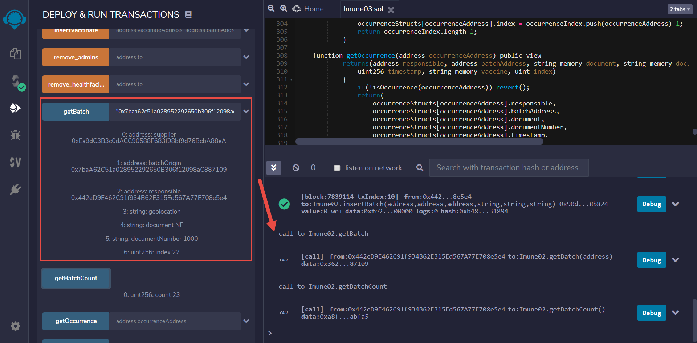

# megahack-criptovaley-time18-backend

- **Desafio:** Crypto Valley
- **Time:** 18
- **Membros:**

    - Anderson Rocha - andersonrocha@outlook.com
    - David Borelli - david_borelli@live.com
    - David Pagliotto - dpagliotto@gmail.com
    - Felipe Guido – felipeguido1@gmail.com
    - Ricardo Bull - rcbull@gmail.com

## Smart Contract = Imune.sol

Smart contract escrito em Solidity e publicado na rede de testes Ropsten [url](https://ropsten.etherscan.io/)

## Exemplos de transação do contrato

O desenvolvimento do smart contract foi realizado no Remix IDE [url](https://remix.ethereum.org/)

1. add_addmins

    Adicionar um address com permissão para utilizar métodos administrativos, como permissionar uma unidade de saúde

2. add_healthfacilities

    Adicionar um address com permissão de unidade de saúde, que pode ser responsável por cadastrar um lote de vacinas, suas
movimentações (transporte ou armazenamento), fracionar um lote (não contemplado nesse MVP) e registrar a vacinação (aplicação por pessoa)

3. insertBatch

    Para registrar um lote de vacinas

4. insertOccurrence

    Para registrar uma ocorrência em relação a uma aplicação de vacina, por exemplo, morte ou efeito adverso

5. insertTransactionBatch

    Para registrar uma movimentação de lote, no caso, ganha outro responsável e tem registro de timestamp e geolocalização

6. insertVaccinate

    Para registrar uma aplicação de vacina

7. getBatch

    Para consultar os detalhes de um lote pelo seu endereço
    
8. getBatchCount

    Para consultar o número de lotes cadastrados no contrato
    
9. getOccurrence

    Para consultar os detalhes de uma ocorrência de vacinação pelo seu endereço
    
10. getOccurrenceCount

    Para consultar o número de ocorrências cadastradas no contrato
    
11. getTransactionBatch

    Para consultar os detalhes de uma transação de lote pelo seu endereço
    
12. getVaccinate

    Para consultar os detalhes de uma aplicação de vacina
    
13. getVaccinateCount

    Para consultar o número de aplicações de vacina cadastradas no contrato

## Exemplos

1. add_admins

2. add_healthfacilities

3. insertBatch

4. getBatch

